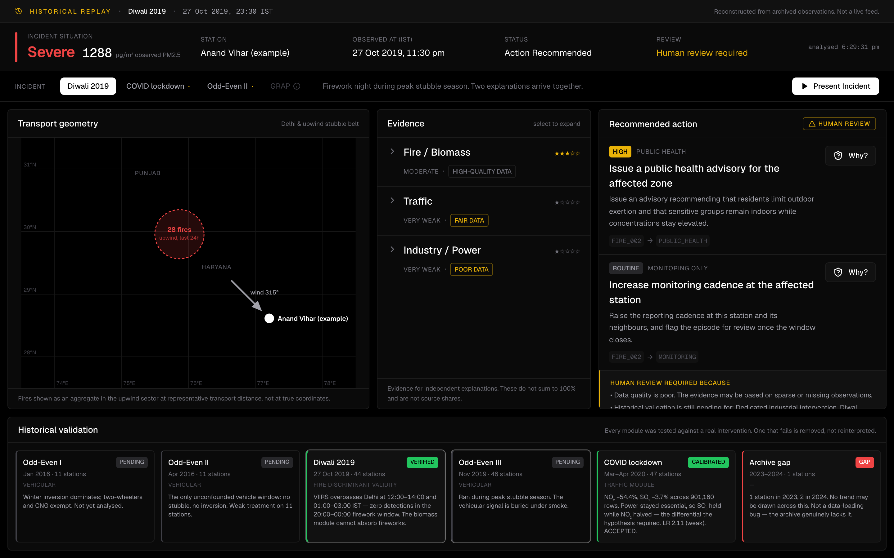
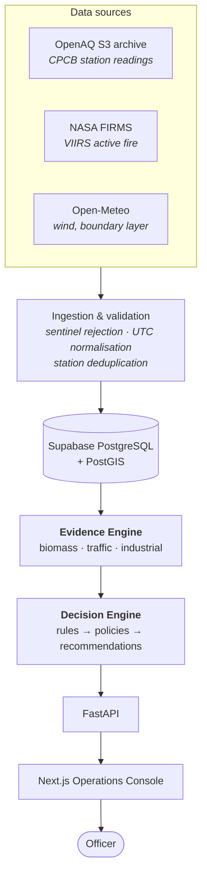
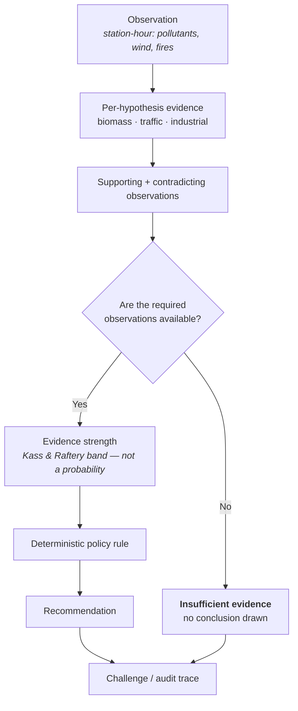

# Vayu Console

**Evidence-backed air quality decisions for urban response teams.**



---

## The problem

An AQI dashboard tells a municipal officer **how bad the air is**. Delhi has many of them.

None of them tell the officer what they actually have to decide: _what evidence exists for
each possible contributor, what action that evidence justifies, and how to defend that action
in a meeting the next morning._

The gap is not measurement. It is reasoning — and the honest handling of the many hours when
the evidence does not support a conclusion at all.

## The solution

```
Situation  →  Evidence  →  Decision  →  Explanation
```

Vayu Console evaluates three independent hypotheses for an observed pollution episode, rates
the evidence for each one, applies deterministic policy rules to that evidence, and exposes
the full audit trace behind every recommendation.

## Why Vayu Console is different

- **Evidence before recommendation.** The Evidence Engine runs first and the Decision Engine
  may only read its output. No rule can reach a recommendation the evidence does not carry.
- **No fabricated source percentages.** The system never claims "40% vehicular". It cannot
  know that, and neither can anything else built on this data.
- **Explicit uncertainty.** Every hypothesis carries an _identification status_ — how well the
  data can isolate it at all — separately from how strong the evidence is on the day.
- **"Insufficient evidence" is a valid output.** When required observations are missing, the
  system says so and recommends nothing. It is a designed state, not an error path.
- **Every recommendation is auditable.** One click shows evidence → rule → policy →
  recommendation, alongside the contradicting evidence, the assumptions and the limitations.

---

## Demo

|                        |                                                                                                                                                                                                         |
| ---------------------- | ------------------------------------------------------------------------------------------------------------------------------------------------------------------------------------------------------- |
| **Operations Console** | **https://vayu-console-web.vercel.app/console**                                                                                                                                                         |
| **API**                | [`/health`](https://vayu-console-api.onrender.com/health) · [`/version`](https://vayu-console-api.onrender.com/version) · [`/evidence/example`](https://vayu-console-api.onrender.com/evidence/example) |

### Historical replay

**Every scenario in the console is a reconstruction of a past incident from archived
observations. Nothing in it is a live feed** — and the console says so on every screen.

This is deliberate. Live data cannot validate a reasoning system, because you never find out
whether it was right. Historical episodes in which a known intervention changed one input and
not the others are the only way to test whether the engine's logic survives contact with
reality.

| Scenario           | Station-hour           | What it demonstrates                                                                                                                                                                                              |
| ------------------ | ---------------------- | ----------------------------------------------------------------------------------------------------------------------------------------------------------------------------------------------------------------- |
| **Diwali 2019**    | 27 Oct 2019, 23:30 IST | Fireworks and peak stubble season arrive together. Strong fire evidence, weak traffic evidence — the engine addresses both without choosing between them.                                                         |
| **COVID lockdown** | 15 Apr 2020            | Traffic stopped by national order: the natural experiment that calibrated the traffic module. Fires and weather were never ingested for this window, so the biomass hypothesis returns **insufficient evidence**. |
| **Odd-Even II**    | 20 Apr 2016            | The only unconfounded vehicle window in the record — no stubble, no winter inversion. Weak treatment on few stations, and the engine reports no more than that.                                                   |

**GRAP is deliberately absent.** It is a threshold-triggered regulatory regime rather than a
dated event, so there is no single station-hour to reconstruct. The console shows it as
unavailable, with that reason, rather than inventing an episode.

---

## Architecture



### Reasoning flow



---

## How it works

### Data layer

Readings come from the **OpenAQ S3 archive** rather than the live API — see
[Key technical findings](#key-technical-findings). Missing-data sentinels (`-999`, `-9999`,
and any negative concentration) are dropped at parse time rather than filtered in queries, so
a sentinel can never reach the database and be forgotten by some later aggregate.

### Evidence Engine

Three modules, each reporting on one hypothesis independently. Strengths **do not sum to 1** —
the hypotheses are not mutually exclusive, and on a Diwali night in stubble season fire and
traffic evidence are both legitimately present.

| Module             | Identification | Why                                                                                                                                                                       |
| ------------------ | -------------- | ------------------------------------------------------------------------------------------------------------------------------------------------------------------------- |
| **Biomass / fire** | Strong         | FIRMS observes fires from orbit, independently of the monitor being explained. The evidence is exogenous.                                                                 |
| **Traffic**        | Weak           | No signal exists outside the chemistry being explained. Calibrated against COVID (LR 2.11 — "weak") and capped at MODERATE in code as a result.                           |
| **Industrial**     | Very weak      | No natural experiment isolates industry, so this module carries **no likelihood ratio at all**. SO₂ is measured at 36 of 96 stations; elsewhere it is blind, and says so. |

### Decision Engine

Deterministic rules over evidence output. Given the same evidence it returns the same
recommendation, every time, with a trace. No model sits between the evidence and the advice.

### Operations Console

A single non-scrolling screen: Situation across the top, then Transport geometry → Evidence →
Recommendations left to right, with the historical validation record beneath. The layout is
the workflow.

---

## Scientific methodology

**This is source-contribution screening, not source apportionment.**

|              | Source apportionment                                              | Source contribution screening _(this system)_          |
| ------------ | ----------------------------------------------------------------- | ------------------------------------------------------ |
| Output       | "Biomass contributed 62 µg/m³"                                    | "Evidence for the biomass hypothesis is moderate"      |
| Requires     | Chemical speciation, receptor modelling (CMB/PMF), tracer species | Routine regulatory monitoring + exogenous observations |
| Ground truth | Measured composition                                              | **None available**                                     |
| Claim        | Quantitative attribution                                          | Ranked plausibility of competing explanations          |

Delhi's regulatory network measures mass concentrations, not composition. Without speciation
there is no ground truth for attribution, so any percentage this system emitted would be
fabricated. It emits none.

Evidence strengths are reported in **Kass & Raftery likelihood-ratio bands**, which are
explicitly _not_ probabilities — and the UI says so wherever a ratio appears.

Detail: [`docs/research/inference.md`](docs/research/inference.md),
[`docs/research/scientific-limitations.md`](docs/research/scientific-limitations.md),
[`submission/scientific-methodology.md`](submission/scientific-methodology.md).

---

## Validation

Modules are tested against real interventions. **A module that fails its test is removed, not
reinterpreted.**

| Experiment         | Date         | Scope                     | Result                                                                                                                                                                                                 |
| ------------------ | ------------ | ------------------------- | ------------------------------------------------------------------------------------------------------------------------------------------------------------------------------------------------------ |
| **COVID lockdown** | Mar–Apr 2020 | 47 stations, 901,160 rows | NO₂ −54.4%, SO₂ −3.7%. NO₂/SO₂ ratio 2.82 → 1.34, **LR 2.11 (weak)**. Power generation stayed essential, so SO₂ held while NO₂ halved — the differential the hypothesis required. **ACCEPTED.**        |
| **Diwali 2019**    | 27 Oct 2019  | 44 stations               | VIIRS overpasses Delhi at 12:00–14:00 and 01:00–03:00 IST — **zero detections** in the 20:00–00:00 firework window. The biomass module is structurally incapable of absorbing fireworks. **VERIFIED.** |
| **Odd-Even II**    | Apr 2016     | 11 stations               | The only unconfounded vehicle window. Weak treatment, few stations. **PENDING** — not yet a passed test, and labelled as such in the UI.                                                               |

The COVID test could have failed. It was run as a falsification attempt: had NO₂ not fallen
relative to SO₂, the traffic module would have been deleted.

---

## Key technical findings

1. **OpenAQ's live API and its S3 archive disagree about coverage.** The API advertises Delhi
   stations it will not actually return history for. Coverage was therefore probed against S3
   directly — the only source whose claimed coverage matches what it returns.
2. **One physical station appears under several OpenAQ location ids.** Naive station counts
   overstate the network and double-count readings into city means.
3. **The 2023–2024 archive gap is real, not a loading bug.** One station in 2023 and two in
   2024, against 50+ in adjacent years. No trend may be drawn across it, and the console shows
   the gap rather than interpolating over it.
4. **CPCB emits missing-data sentinels as if they were readings.** `-999` is the classic one;
   values near `-476300` were observed in CO. Any negative concentration is impossible, so all
   of them are dropped at parse time.
5. **VIIRS overpass timing is a hard constraint on fire evidence.** The satellite sees Delhi
   twice a day. An absence of detections in the last few hours may be an absence of _overpass_
   rather than an absence of fire — which is why the system reports observation gaps instead
   of treating them as negative findings.
6. **A self-labelled source classifier reached 98.6% accuracy and was rejected**, because it
   had learned the labelling rule rather than the atmosphere. See
   [the judge FAQ](submission/judge-faq.md).

---

## Technology stack

| Layer         | Choice                                                                         |
| ------------- | ------------------------------------------------------------------------------ |
| Frontend      | Next.js 15 (App Router), TypeScript, Tailwind CSS v4, TanStack Query           |
| Visualisation | Hand-built SVG — no tile server, no API key, no SSR workaround                 |
| Backend       | Python 3.12, FastAPI, Pydantic v2, SQLAlchemy 2, Alembic                       |
| Database      | Supabase PostgreSQL + PostGIS                                                  |
| Deploy        | Vercel (web), Render — Singapore region (api)                                  |
| Checks        | pytest, Playwright (68 E2E × 2 viewports), ruff, black, mypy, ESLint, Prettier |

Both apps share types from `packages/shared`, so an API schema change surfaces as a frontend
type error rather than a runtime surprise.

---

## Running locally

**Prerequisites:** Node.js 20+, Python 3.12+.

```bash
git clone https://github.com/Pranavsingh431/vayu_console.git
cd vayu_console

npm install                            # frontend + shared packages (npm workspaces)

cd apps/api
python3.12 -m venv .venv
source .venv/bin/activate
pip install -e ".[dev]"
cd ../..

cp .env.example .env
cp apps/web/.env.example apps/web/.env.local
```

Run both, in two terminals:

```bash
npm run dev:api     # http://localhost:8000
npm run dev:web     # http://localhost:3000
```

**No database?** The Diwali scenario is served from a fixed context and needs none, so the
console's primary demo path works against a bare checkout. The COVID and Odd-Even scenarios
query ingested data and need `DATABASE_URL`.

## Testing

```bash
# Frontend
npm run format:check
npm run lint
npm run typecheck
npm run build
npm run e2e --workspace apps/web       # 68 tests, API mocked at the network boundary

# Backend
cd apps/api
.venv/bin/ruff check .
.venv/bin/black --check .
.venv/bin/mypy app tests
.venv/bin/pytest
```

The E2E suite mocks the API by default so it passes on a laptop with no database and on CI
with no secrets. A suite that needs live infrastructure is a suite nobody runs, and an unrun
suite protects nothing.

Regenerate the submission screenshots from the real application:

```bash
npm run screenshots --workspace apps/web
```

## Deployment

See [`docs/deployment.md`](docs/deployment.md). In short: the Render blueprint
(`render.yaml`) for the API, Vercel for the web app.

`CORS_ORIGINS` **must** list the deployed web origin. An empty value used to disable the CORS
middleware entirely — `/health` kept returning 200 to curl while every browser request was
blocked and the console rendered blank. The service now refuses to boot rather than serve
nobody.

---

## Limitations

The full list: [`docs/research/scientific-limitations.md`](docs/research/scientific-limitations.md)
and [`submission/known-limitations.md`](submission/known-limitations.md). The headlines:

- **No ground truth for attribution exists.** Nothing here is validated against measured
  aerosol composition, because none is collected.
- **Diwali is permanently confounded with stubble burning.** They co-occur every year. The
  system addresses both hypotheses rather than separating them, because it cannot separate
  them.
- **The traffic hypothesis is weakly identified** (LR 2.11) and capped at MODERATE in code.
- **Industry carries no likelihood ratio at all**, and SO₂ reaches only 36 of 96 stations.
- **The system does not forecast.** It offers reassessment windows, never predicted
  concentrations, and cannot estimate the effect of any action it recommends.
- **Delhi only**, and the console replays historical incidents rather than running live.

## Future work

Deliberately _not_ attempted for this submission, and why:

- **Live ingestion.** The pipeline supports it; the validation story does not benefit from it.
- **Speciation-based apportionment.** Requires instrumentation Delhi does not have.
- **More cities.** The evidence modules are Delhi-calibrated. Porting them means re-running
  the natural experiments, not changing a config value.
- **Odd-Even I and III analysis.** Both are confounded (winter inversion; peak stubble). They
  are listed as PENDING rather than quietly dropped.

## Submission materials

[`submission/`](submission/) — [demo script](submission/demo-script.md) ·
[judge FAQ](submission/judge-faq.md) · [pitch outline](submission/pitch-outline.md) ·
[scientific methodology](submission/scientific-methodology.md) ·
[technical highlights](submission/technical-highlights.md) ·
[known limitations](submission/known-limitations.md)

## Team

Pranav Singh — [@Pranavsingh431](https://github.com/Pranavsingh431)

## Licence

MIT — see [LICENSE](LICENSE).
